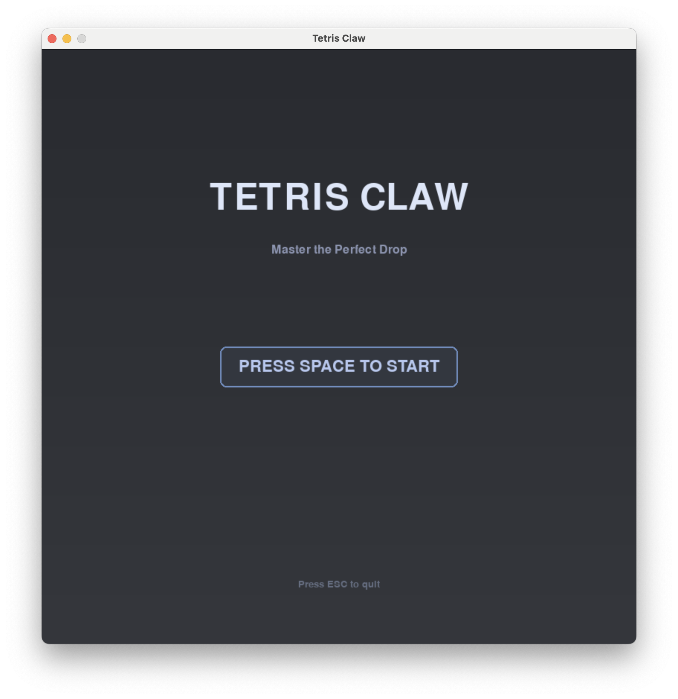

# 🎮 俄罗斯方块爪机游戏 / Tetris Claw Machine Game

> 🌐 **在线体验网页版 / Try Web Version:** [https://mckenzieaaa.github.io/Prize-Claw/](https://mckenzieaaa.github.io/Prize-Claw/)

一款融合了经典俄罗斯方块和抓娃娃机玩法的创意 Python 游戏。使用优雅的莫兰迪色调，通过机械爪抓取方块并送入收集框获得分数！

A creative Python game combining classic Tetris with claw machine gameplay. Features elegant Morandi color palette - grab blocks with a mechanical claw and deliver them to earn points!


## ✨ 核心特性 / Key Features

- � **莫兰迪配色方案** - 柔和的7色主题（蓝/粉/绿/紫/黄/橙/灰）
- 🎨 **Morandi Color Palette** - 7 elegant colors (blue/pink/green/purple/yellow/orange/gray)

- 🕹️ **三种游戏模式** - 无尽模式、限时模式、关卡模式
- 🕹️ **Three Game Modes** - Endless, Time Attack, and Levels

- 🌊 **物理重力系统** - 抓取底部方块时上方方块自动下落
- 🌊 **Physics Gravity System** - Upper blocks fall when bottom blocks are grabbed

- 🎆 **粒子特效系统** - 烟花和破碎效果，全屏漂浮粒子背景
- 🎆 **Particle Effects** - Fireworks and shatter animations with floating background particles

- 🎮 **精美机械爪设计** - 三层渲染（阴影→主体→高光）
- 🎮 **Beautiful Claw Design** - Three-layer rendering (shadow→main→highlight)

- 📊 **完整分数系统** - 自动保存各模式最高分
- 📊 **Complete Scoring** - Auto-saves high scores for each mode

## 🎯 游戏截图 / Screenshots

<!-- 游戏截图将显示在此处 -->
<!-- Screenshots will be displayed here -->




## 🎮 操作说明 / Controls

| 按键 / Key | 功能 / Function |
|------------|-----------------|
| **W** / ↑ | 向上移动爪子 / Move claw up |
| **S** / ↓ | 向下移动爪子 / Move claw down |
| **A** / ← | 向左移动爪子 / Move claw left |
| **D** / → | 向右移动爪子 / Move claw right |
| **空格 / SPACE** | 抓取/释放方块 / Grab/Release block |
| **ESC** | 打开/关闭菜单 / Open/Close menu |

## 📦 安装与运行 / Installation & Running

### 环境要求 / Requirements
- Python 3.8 或更高版本 / Python 3.8 or higher
- Pygame 2.6.1 或更高版本 / Pygame 2.6.1 or higher

### 安装步骤 / Installation Steps

1. **克隆仓库 / Clone repository**
```bash
git clone https://github.com/mckenzieaaa/Farm.git
cd Farm/python_tetris_claw
```

2. **安装依赖 / Install dependencies**
```bash
pip install pygame
```

3. **运行游戏 / Run game**
```bash
python main.py
```

或 / Or:
```bash
python3 main.py
```

## 🎯 游戏规则 / Game Rules

1. **方块生成** - 俄罗斯方块每 3.5 秒从底部生成一次
   **Block Spawning** - Tetris blocks spawn from bottom every 3.5 seconds

2. **抓取机制** - 移动机械爪到方块附近，按空格键抓取
   **Grab Mechanism** - Move claw near blocks and press spacebar to grab

3. **配送流程** - 抓取后方块自动送往右下角的 EXIT 收集框
   **Delivery Process** - Grabbed blocks are auto-delivered to EXIT box

4. **得分系统** - 每成功配送一个方块获得 100 分
   **Scoring** - Earn 100 points per successfully delivered block

5. **游戏失败** - 堆叠方块超过红色危险线（第3行）时游戏结束
   **Game Over** - Game ends when blocks exceed red danger line (row 3)

6. **重力效果** - 抓走底部方块后，上方悬空的方块会自动下落
   **Gravity** - Suspended blocks automatically fall when lower blocks are removed

## 🎨 设计亮点 / Design Highlights

- **莫兰迪美学** - 整体色调温柔舒适，避免刺眼配色
  **Morandi Aesthetics** - Soft and comfortable colors

- **物理真实感** - 重力系统让方块行为更加自然
  **Physical Realism** - Gravity system for natural block behavior

- **视觉反馈** - 烟花和破碎特效增强玩家成就感
  **Visual Feedback** - Firework and shatter effects for satisfaction

- **流畅动画** - 60 FPS 帧率保证丝滑体验
  **Smooth Animation** - 60 FPS for silky gameplay

## 🛠️ 技术实现 / Technology Stack

- **Python 3.8+** - 主要编程语言 / Primary language
- **Pygame 2.6.1** - 游戏引擎和图形渲染 / Game engine
- **数据类 (dataclass)** - 粒子系统 / Particle system
- **枚举类 (Enum)** - 游戏状态管理 / State management

### 核心系统 / Core Systems

1. **游戏状态管理** - 7种游戏状态的枚举管理
   **State Management** - Enum-based management of 7 game states

2. **方块生成与堆叠** - 智能堆叠算法，坐标归一化，碰撞检测
   **Block Spawning** - Smart stacking, coordinate normalization, collision detection

3. **重力物理系统** - 悬空方块自动下落
   **Gravity Physics** - Automatic falling for suspended blocks

4. **粒子系统** - 烟花和碎片两种效果
   **Particle System** - Firework and debris effects

5. **机械爪动画** - 四阶段配送流程
   **Claw Animation** - Four-stage delivery process

6. **视觉渲染优化** - 三层渲染、Alpha混合、正弦波动画
   **Visual Rendering** - 3-layer rendering, alpha blending, sine wave animation

## 📁 项目结构 / Project Structure

```
Farm/
├── README.md                    # 项目主说明 / Main README
└── python_tetris_claw/         # Pygame 版本 / Pygame version
    ├── main.py                 # 主程序 (1,270+ 行) / Main program
    ├── requirements.txt        # 依赖列表 / Dependencies
    ├── README.md              # 详细文档 / Detailed docs
    ├── QUICKSTART.md          # 快速开始 / Quick start
    ├── GAMEPLAY.md            # 游戏攻略 / Gameplay guide
    ├── DEVELOPER_GUIDE.md     # 开发指南 / Dev guide
    └── screenshots/           # 游戏截图 / Screenshots
```

## 📚 完整文档 / Full Documentation

详细文档请查看 `python_tetris_claw` 目录：
For detailed documentation, see the `python_tetris_claw` directory:

- 📖 [完整 README](python_tetris_claw/README.md) - 详细的游戏说明和技术文档
- 🚀 [快速开始指南](python_tetris_claw/QUICKSTART.md) - 3步快速上手
- 🎮 [游戏攻略](python_tetris_claw/GAMEPLAY.md) - 详细玩法和策略
- 💻 [开发者指南](python_tetris_claw/DEVELOPER_GUIDE.md) - 代码架构和API
- 🖼️ [界面说明](python_tetris_claw/SCREENSHOTS.md) - UI元素详解

## 🌐 在线体验 / Online Version

除了本地运行的 Pygame 版本，我还制作了一个网页版本，您可以直接在浏览器中体验！

In addition to the local Pygame version, there's also a web version you can play directly in your browser!

🔗 **立即游玩 / Play Now:** [https://mckenzieaaa.github.io/Prize-Claw/](https://mckenzieaaa.github.io/Prize-Claw/)

网页版基于 Phaser 3 框架开发，支持移动端触控操作。
The web version is built with Phaser 3 and supports mobile touch controls.

## 📄 许可证 / License

This project is open source and available under the MIT License.

## 👨‍� 作者 / Author

Created with ❤️ by mckenzieaaa

## 🙏 致谢 / Acknowledgments

- Pygame 社区提供的优秀游戏开发框架
- Pygame community for the excellent game framework
- 经典俄罗斯方块的游戏灵感
- Classic Tetris for gameplay inspiration
- 莫兰迪色彩理论的美学指导
- Morandi color theory for aesthetic guidance
