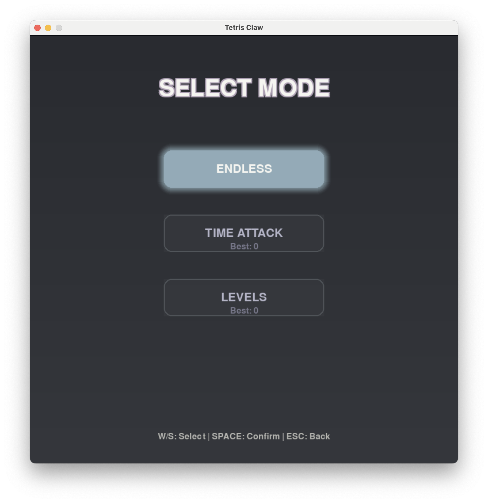
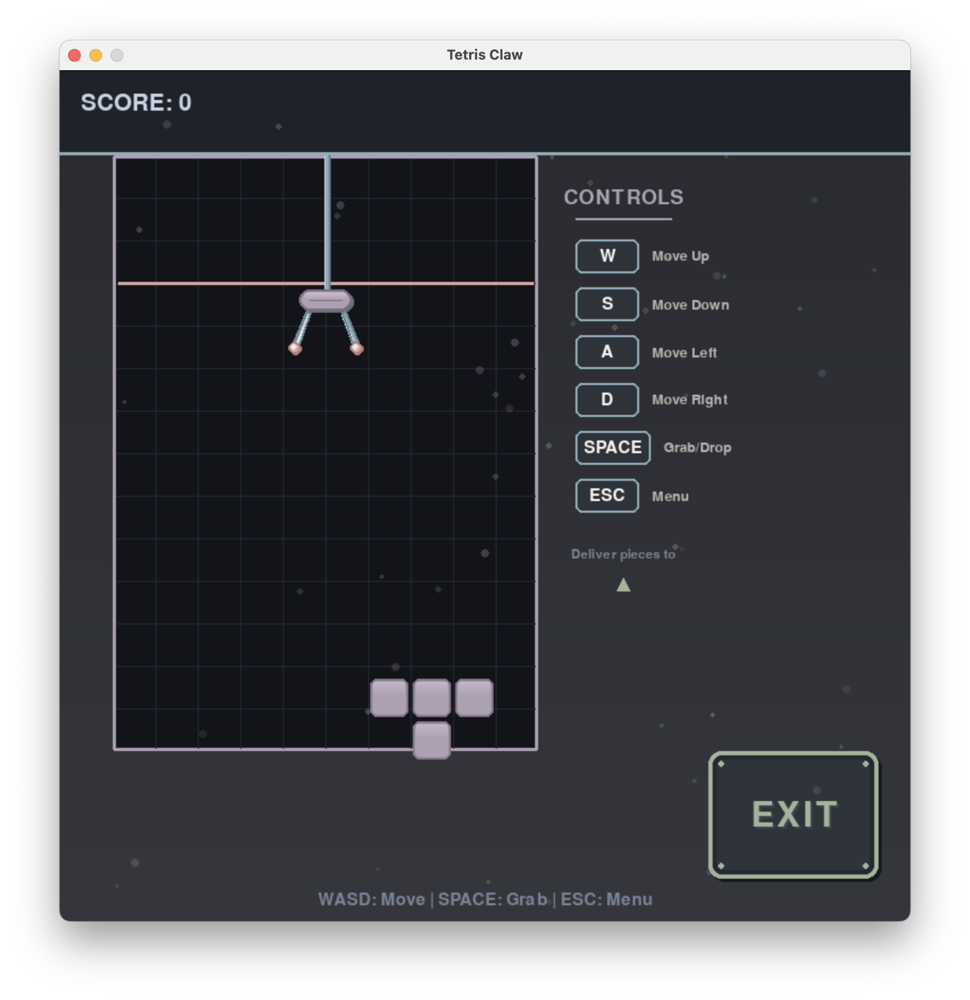
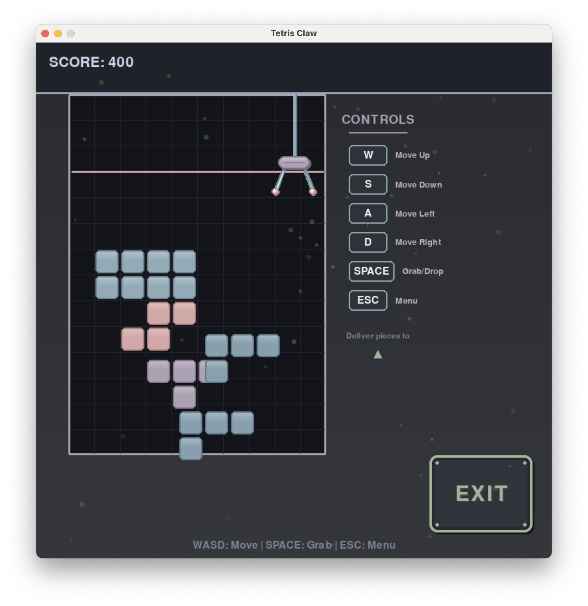
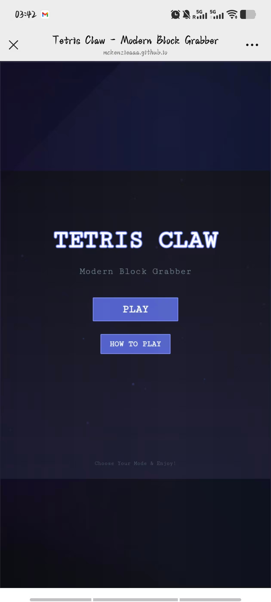
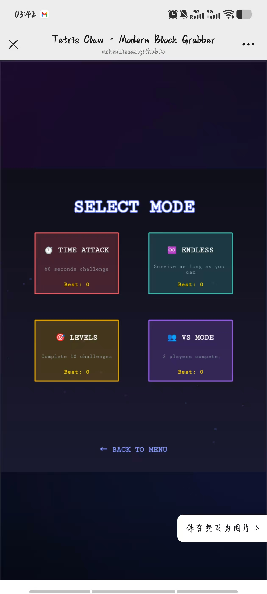
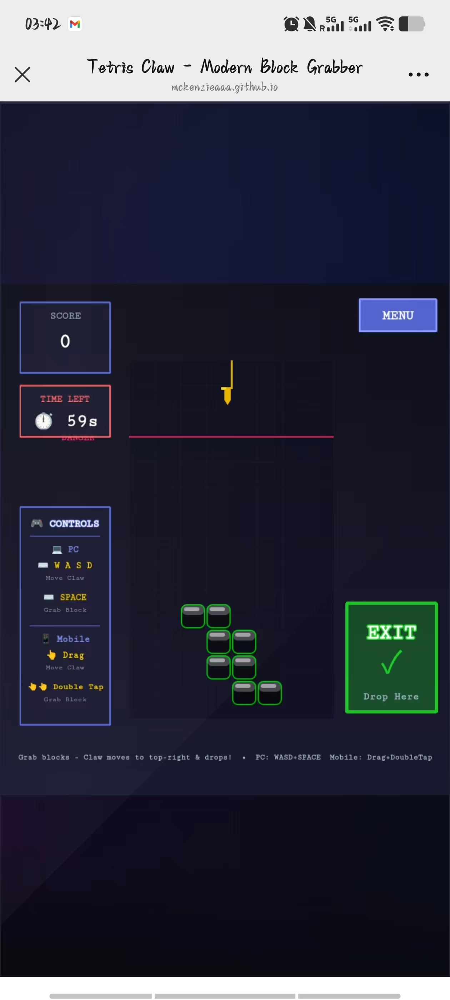
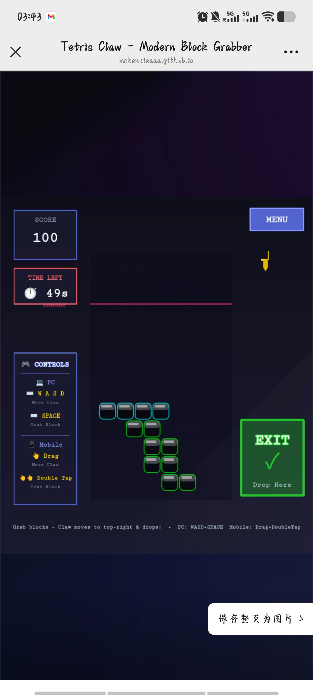
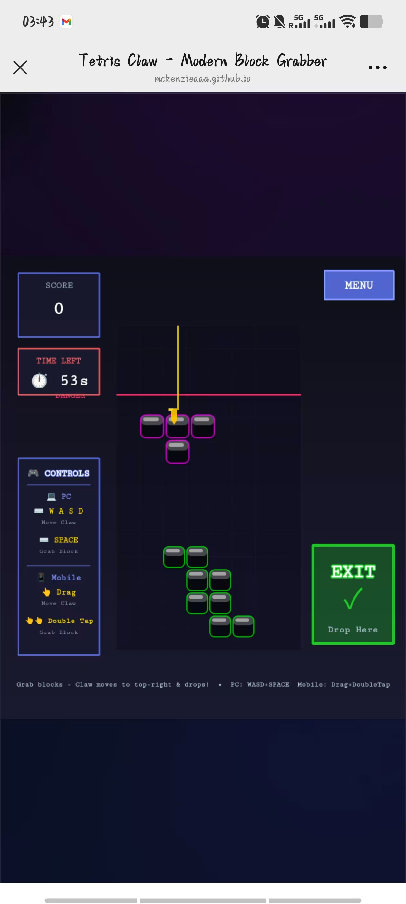

# 🎮 Tetris Claw Machine Game

> 🌐 **Play Web Version:** [https://mckenzieaaa.github.io/Prize-Claw/](https://mckenzieaaa.github.io/Prize-Claw/)

A creative Python game combining classic Tetris with claw machine gameplay. Grab blocks with a mechanical claw and deliver them to the EXIT box to earn points!

## 📸 Game Screenshots

  
  
  

  
  

  <em>Main Menu • Mode Selection • Gameplay Start • Gameplay Action • Game Over</em>

## ✨ Key Features

- 🕹️ **Three Game Modes** - Endless, Time Attack, and Levels
- 🌊 **Physics Gravity System** - Upper blocks fall when bottom blocks are grabbed
- 🎆 **Particle Effects** - Fireworks and shatter animations with floating background particles
- 🎮 **Mechanical Claw** - Smooth movement and auto-delivery system
- 📊 **Complete Scoring** - Auto-saves high scores for each mode
- 🎯 **7 Tetris Shapes** - All classic tetromino pieces (I, O, T, S, Z, J, L)

## 🎮 Controls

| Key | Function |
|-----|----------|
| **W** / ↑ | Move claw up |
| **S** / ↓ | Move claw down |
| **A** / ← | Move claw left |
| **D** / → | Move claw right |
| **SPACE** | Grab/Release block |
| **ESC** | Open/Close menu |

## 📦 Installation & Running

### Requirements
- Python 3.8 or higher
- Pygame 2.6.1 or higher

### Installation Steps

1. **Clone repository**
\`\`\`bash
git clone https://github.com/mckenzieaaa/Farm.git
cd Farm/python_tetris_claw
\`\`\`

2. **Install dependencies**
\`\`\`bash
pip install pygame
\`\`\`

3. **Run game**
\`\`\`bash
python main.py
\`\`\`

Or:
\`\`\`bash
python3 main.py
\`\`\`

## 🎯 Game Rules

1. **Block Spawning** - Tetris blocks spawn from bottom every 3.5 seconds

2. **Grab Mechanism** - Move claw near blocks and press spacebar to grab

3. **Delivery Process** - Grabbed blocks are auto-delivered to EXIT box

4. **Scoring** - Earn 100 points per successfully delivered block

5. **Game Over** - Game ends when blocks exceed red danger line (row 3)

6. **Gravity** - Suspended blocks automatically fall when lower blocks are removed

## 🛠️ Technology Stack

- **Python 3.8+** - Primary language
- **Pygame 2.6.1** - Game engine
- **Dataclass** - Particle system
- **Enum** - State management

### Core Systems

1. **State Management** - Enum-based management of 7 game states

2. **Block Spawning** - Smart stacking, coordinate normalization, collision detection

3. **Gravity Physics** - Automatic falling for suspended blocks

4. **Particle System** - Firework and debris effects

5. **Claw Animation** - Four-stage delivery process

6. **Visual Rendering** - Multi-layer rendering, alpha blending, sine wave animation

## 📁 Project Structure

\`\`\`
Farm/
├── README.md                    # Main README
└── python_tetris_claw/         # Pygame version
    ├── main.py                 # Main program (1,270+ lines)
    ├── requirements.txt        # Dependencies
    ├── README.md              # Detailed docs
    ├── QUICKSTART.md          # Quick start
    ├── GAMEPLAY.md            # Gameplay guide
    ├── DEVELOPER_GUIDE.md     # Dev guide
    └── screenshots/           # Game screenshots
\`\`\`

## 📚 Full Documentation

For detailed documentation, see the \`python_tetris_claw\` directory:

- 📖 [Complete README](python_tetris_claw/README.md) - Detailed game documentation
- 🚀 [Quick Start Guide](python_tetris_claw/QUICKSTART.md) - Get started in 3 steps
- 🎮 [Gameplay Guide](python_tetris_claw/GAMEPLAY.md) - Detailed strategies
- 💻 [Developer Guide](python_tetris_claw/DEVELOPER_GUIDE.md) - Code architecture
- 🖼️ [Screenshots Guide](python_tetris_claw/SCREENSHOTS.md) - UI elements

## 🌐 Web Version

In addition to the local Pygame version, there's also a web version you can play directly in your browser!

🔗 **Play Now:** [https://mckenzieaaa.github.io/Prize-Claw/](https://mckenzieaaa.github.io/Prize-Claw/)

The web version is built with Phaser 3 and supports mobile touch controls.

### Web Version Screenshots

  
  
  

  
  

  <em>Web Version: Menu • Gameplay Views • Game Over</em>

## 📄 License

This project is open source and available under the MIT License.

## 👨‍�� Author

Created with ❤️ by mckenzieaaa

## 🙏 Acknowledgments

- Pygame community for the excellent game framework
- Classic Tetris for gameplay inspiration
