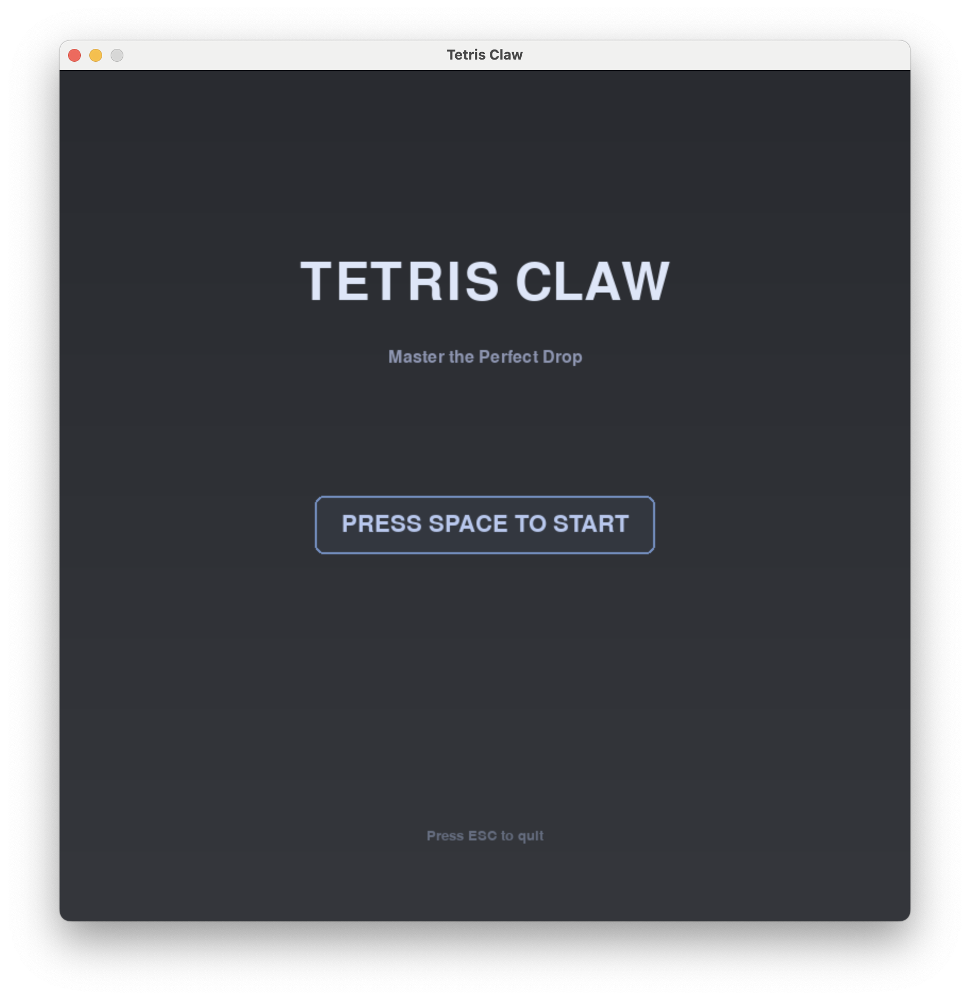

# 🎮 俄罗斯方块爪机游戏 / Tetris Claw Machine Game

[中文](#中文) | [English](#english)

---

## 中文

### 📖 游戏简介

这是一款融合了经典俄罗斯方块和抓娃娃机玩法的创意 Python 游戏。玩家通过控制机械爪抓取不断生成的俄罗斯方块，并将它们送入右下角的收集框中以获得分数。游戏采用优雅的莫兰迪色调，营造出舒适温馨的视觉体验。

### ✨ 核心特性

- 🎨 **莫兰迪配色方案**：采用柔和的莫兰迪色系，包括蓝、粉、绿、紫、黄、橙、灰七种主题色调
- 🕹️ **创新玩法**：结合俄罗斯方块和抓娃娃机的独特机制
- 🎯 **三种游戏模式**：
  - **无尽模式 (Endless)**：挑战最高分，没有时间限制
  - **限时模式 (Time Attack)**：60秒内尽可能多地收集方块
  - **关卡模式 (Levels)**：完成每关目标数量的方块收集
- 🌊 **物理重力系统**：抓取底部方块时，上方方块会真实下落
- 🎆 **粒子特效系统**：
  - 方块进入收集框时触发烟花和破碎特效
  - 全屏漂浮粒子背景营造氛围
- 🎮 **精美机械爪设计**：三层渲染（阴影→主体→高光），带有真实的抓取动画
- 📊 **分数与排行榜**：自动保存各模式的最高分记录

### 🎯 游戏截图

<!-- 在此处放置游戏主菜单截图 -->


<!-- 在此处放置游戏进行中截图 -->


<!-- 在此处放置操作说明面板截图 -->


<!-- 在此处放置粒子特效截图 -->


### 🎮 操作说明

| 按键 | 功能 |
|------|------|
| **W** / ↑ | 向上移动爪子 |
| **S** / ↓ | 向下移动爪子 |
| **A** / ← | 向左移动爪子 |
| **D** / → | 向右移动爪子 |
| **空格键** | 抓取/释放方块 |
| **ESC** | 打开/关闭菜单 |

### 🔧 技术实现

#### 使用的技术栈
- **Python 3.8+**：主要编程语言
- **Pygame 2.6.1**：游戏引擎和图形渲染
- **数据类 (dataclass)**：用于粒子系统和游戏对象
- **枚举类 (Enum)**：管理游戏状态和模式

#### 核心系统架构

##### 1. 游戏状态管理
使用枚举类管理七种不同的游戏状态，确保状态转换的清晰性和可维护性：
```python
class GameMode(Enum):
    MENU = "menu"
    MODE_SELECT = "mode_select"
    ENDLESS = "endless"
    TIME_ATTACK = "time_attack"
    LEVELS = "levels"
    GAME_OVER = "game_over"
    LEVEL_COMPLETE = "level_complete"
```

##### 2. 方块生成与堆叠系统
- **智能堆叠算法**：方块从底部生成，自动检测已有方块并精确堆叠
- **坐标归一化**：将方块坐标标准化到 (0,0) 原点，确保准确计算
- **碰撞检测**：逐列扫描网格，找到最顶部的障碍物作为堆叠基准

```python
def spawn_tetromino(self):
    # 归一化方块坐标
    normalized_blocks = [(bx - min_x, by - min_y) for bx, by in blocks]
    # 检测每列的障碍物
    for col in range(shape_width):
        for row in range(GRID_HEIGHT):
            if self.grid[row][col] is not None:
                max_spawn_row = row - by - 1
                spawn_row = min(spawn_row, max_spawn_row)
```

##### 3. 重力物理系统
当抓取方块后，系统会自动应用重力，让悬空的方块下落：
```python
def apply_gravity(self):
    # 循环检测直到没有方块可以下落
    while changed:
        for tetromino in self.tetrominoes:
            if self.check_can_fall(tetromino):
                # 下落一行并更新网格
                tetromino.y += BLOCK_SIZE
```

##### 4. 粒子系统
使用数据类实现高效的粒子管理，支持烟花和碎片两种效果：
```python
@dataclass
class Particle:
    x: float
    y: float
    vx: float
    vy: float
    color: tuple
    lifetime: int
    size: int
    particle_type: str  # 'firework' 或 'debris'
```

粒子系统特性：
- **重力加速度**：`vy += 0.3` 模拟真实的重力效果
- **空气阻力**：`vx *= 0.98` 让粒子逐渐减速
- **生命周期衰减**：粒子随时间逐渐消失
- **Alpha 混合**：基于生命周期的透明度渐变

##### 5. 机械爪动画系统
机械爪包含四个精心设计的配送阶段：
1. **Stage 1 - Lifting (提升)**：垂直提升到顶部
2. **Stage 2 - Moving Right (横移)**：水平移动到 EXIT 上方
3. **Stage 3 - Lowering (下降)**：下降到 EXIT 位置
4. **Stage 4 - Falling (释放)**：释放方块，触发下落动画和粒子特效

##### 6. 视觉渲染优化
- **三层渲染技术**：阴影层 → 主体层 → 高光层，营造立体感
- **Alpha 混合**：使用半透明表面实现柔和的视觉效果
- **圆角矩形**：使用 `border_radius` 参数创建现代 UI 元素
- **正弦波动画**：漂浮粒子使用正弦函数创建自然的起伏效果

```python
# 粒子漂浮动画
p['phase'] += p['speed'] * 0.05
p['y'] = p['base_y'] + math.sin(p['phase']) * p['amplitude']
```

机械爪渲染细节：
```python
# 绳索 - 带阴影和高光
pygame.draw.line(screen, shadow_color, (x, top), (x+2, bottom), 4)  # 阴影
pygame.draw.line(screen, MORANDI_BLUE, (x, top), (x, bottom), 3)   # 主体
pygame.draw.line(screen, highlight_color, (x-1, top), (x-1, bottom), 1)  # 高光
```

### 📦 安装与运行

#### 环境要求
- Python 3.8 或更高版本
- Pygame 2.6.1 或更高版本

#### 安装步骤

1. **克隆仓库**
```bash
git clone https://github.com/mckenzieaaa/Farm.git
cd Farm/python_tetris_claw
```

2. **安装依赖**
```bash
pip install pygame
```

3. **运行游戏**
```bash
python main.py
```

或使用 Python 3：
```bash
python3 main.py
```

### 🎯 游戏规则

1. **方块生成**：俄罗斯方块每 3.5 秒从底部生成一次
2. **抓取机制**：移动机械爪到方块附近，按空格键抓取
3. **配送流程**：抓取后方块会自动被送往右下角的 EXIT 收集框
4. **得分系统**：每成功配送一个方块获得 100 分
5. **游戏失败**：当堆叠的方块超过红色危险线（第3行）时游戏结束
6. **重力效果**：抓走底部方块后，上方悬空的方块会自动下落

### 🌟 设计亮点

- **莫兰迪美学**：整体色调温柔舒适，避免传统游戏的刺眼配色
- **物理真实感**：重力系统让方块行为更加自然
- **视觉反馈**：烟花和破碎特效增强玩家成就感
- **流畅动画**：60 FPS 帧率保证丝滑的游戏体验
- **渐进式难度**：关卡模式逐步增加挑战性

### 🌐 在线体验

除了本地运行，我还制作了一个网页版本，您可以直接在浏览器中体验这款游戏！

<!-- 在此处添加网页版链接 -->
🔗 [点击这里在线游玩](https://your-game-url.com)

### 📁 项目结构

```
python_tetris_claw/
├── main.py              # 主程序文件 (1200+ 行)
├── README.md            # 项目说明文档
└── screenshots/         # 游戏截图文件夹
    ├── menu.png        # 主菜单截图
    ├── gameplay.png    # 游戏画面截图
    ├── controls.png    # 操作界面截图
    └── particles.png   # 粒子特效截图
```

### 🎓 代码统计

- **总代码量**：约 1,270 行
- **核心类**：
  - `Tetromino`：俄罗斯方块类
  - `Claw`：机械爪类
  - `Particle`：粒子类（数据类）
  - `Game`：游戏主控制类
  - `GameMode`：游戏模式枚举

---

## English

### 📖 Game Introduction

This is a creative Python game that combines classic Tetris with claw machine gameplay. Players control a mechanical claw to grab continuously spawning Tetris pieces and deliver them to the collection box in the bottom-right corner to earn points. The game features an elegant Morandi color palette, creating a comfortable and cozy visual experience.

### ✨ Core Features

- 🎨 **Morandi Color Scheme**: Soft Morandi color palette with seven theme colors: blue, pink, green, purple, yellow, orange, and gray
- 🕹️ **Innovative Gameplay**: Unique mechanics combining Tetris and claw machine elements
- 🎯 **Three Game Modes**:
  - **Endless Mode**: Challenge for high scores without time limits
  - **Time Attack Mode**: Collect as many blocks as possible in 60 seconds
  - **Levels Mode**: Complete each level's target block collection
- 🌊 **Physics Gravity System**: Upper blocks realistically fall when bottom blocks are grabbed
- 🎆 **Particle Effects System**:
  - Firework and shatter effects when blocks enter the collection box
  - Full-screen floating particle background for atmosphere
- 🎮 **Exquisite Claw Design**: Three-layer rendering (shadow → main → highlight) with realistic grab animations
- 📊 **Scoring & Leaderboard**: Auto-saves high scores for each mode

### 🎯 Game Screenshots

<!-- Place main menu screenshot here -->


<!-- Place gameplay screenshot here -->


<!-- Place controls panel screenshot here -->


<!-- Place particle effects screenshot here -->


### 🎮 Controls

| Key | Function |
|-----|----------|
| **W** / ↑ | Move claw up |
| **S** / ↓ | Move claw down |
| **A** / ← | Move claw left |
| **D** / → | Move claw right |
| **Spacebar** | Grab/Release block |
| **ESC** | Open/Close menu |

### 🔧 Technical Implementation

#### Technology Stack
- **Python 3.8+**: Primary programming language
- **Pygame 2.6.1**: Game engine and graphics rendering
- **dataclass**: For particle system and game objects
- **Enum**: Managing game states and modes

#### Core System Architecture

##### 1. Game State Management
Using enum class to manage seven different game states, ensuring clarity and maintainability of state transitions:
```python
class GameMode(Enum):
    MENU = "menu"
    MODE_SELECT = "mode_select"
    ENDLESS = "endless"
    TIME_ATTACK = "time_attack"
    LEVELS = "levels"
    GAME_OVER = "game_over"
    LEVEL_COMPLETE = "level_complete"
```

##### 2. Block Spawning & Stacking System
- **Smart Stacking Algorithm**: Blocks spawn from bottom, auto-detecting existing blocks for precise stacking
- **Coordinate Normalization**: Standardizes block coordinates to (0,0) origin for accurate calculations
- **Collision Detection**: Scans grid column-by-column to find topmost obstacles as stacking reference

```python
def spawn_tetromino(self):
    # Normalize block coordinates
    normalized_blocks = [(bx - min_x, by - min_y) for bx, by in blocks]
    # Detect obstacles in each column
    for col in range(shape_width):
        for row in range(GRID_HEIGHT):
            if self.grid[row][col] is not None:
                max_spawn_row = row - by - 1
                spawn_row = min(spawn_row, max_spawn_row)
```

##### 3. Gravity Physics System
When a block is grabbed, the system automatically applies gravity to make floating blocks fall:
```python
def apply_gravity(self):
    # Loop until no blocks can fall
    while changed:
        for tetromino in self.tetrominoes:
            if self.check_can_fall(tetromino):
                # Fall one row and update grid
                tetromino.y += BLOCK_SIZE
```

##### 4. Particle System
Efficient particle management using dataclass, supporting both firework and debris effects:
```python
@dataclass
class Particle:
    x: float
    y: float
    vx: float
    vy: float
    color: tuple
    lifetime: int
    size: int
    particle_type: str  # 'firework' or 'debris'
```

Particle system features:
- **Gravity Acceleration**: `vy += 0.3` simulates realistic gravity
- **Air Resistance**: `vx *= 0.98` gradually slows particles
- **Lifetime Decay**: Particles gradually disappear over time
- **Alpha Blending**: Transparency gradient based on lifetime

##### 5. Claw Animation System
The claw includes four carefully designed delivery stages:
1. **Stage 1 - Lifting**: Vertically lift to top
2. **Stage 2 - Moving Right**: Horizontally move above EXIT
3. **Stage 3 - Lowering**: Descend to EXIT position
4. **Stage 4 - Falling**: Release block, trigger falling animation and particle effects

##### 6. Visual Rendering Optimization
- **Three-Layer Rendering**: Shadow layer → Main layer → Highlight layer for depth
- **Alpha Blending**: Semi-transparent surfaces for soft visual effects
- **Rounded Rectangles**: Modern UI elements using `border_radius` parameter
- **Sine Wave Animation**: Floating particles use sine function for natural undulation

```python
# Particle floating animation
p['phase'] += p['speed'] * 0.05
p['y'] = p['base_y'] + math.sin(p['phase']) * p['amplitude']
```

Claw rendering details:
```python
# Rope - with shadow and highlight
pygame.draw.line(screen, shadow_color, (x, top), (x+2, bottom), 4)  # Shadow
pygame.draw.line(screen, MORANDI_BLUE, (x, top), (x, bottom), 3)   # Main
pygame.draw.line(screen, highlight_color, (x-1, top), (x-1, bottom), 1)  # Highlight
```

### 📦 Installation & Running

#### Requirements
- Python 3.8 or higher
- Pygame 2.6.1 or higher

#### Installation Steps

1. **Clone the repository**
```bash
git clone https://github.com/mckenzieaaa/Farm.git
cd Farm/python_tetris_claw
```

2. **Install dependencies**
```bash
pip install pygame
```

3. **Run the game**
```bash
python main.py
```

Or using Python 3:
```bash
python3 main.py
```

### 🎯 Game Rules

1. **Block Spawning**: Tetris blocks spawn from the bottom every 3.5 seconds
2. **Grab Mechanism**: Move the claw near a block and press spacebar to grab
3. **Delivery Process**: Grabbed blocks are automatically delivered to the EXIT collection box in the bottom-right
4. **Scoring System**: Earn 100 points for each successfully delivered block
5. **Game Over**: Game ends when stacked blocks exceed the red danger line (row 3)
6. **Gravity Effect**: When bottom blocks are grabbed, suspended upper blocks automatically fall

### 🌟 Design Highlights

- **Morandi Aesthetics**: Overall soft and comfortable color scheme, avoiding harsh traditional game colors
- **Physical Realism**: Gravity system makes block behavior more natural
- **Visual Feedback**: Firework and shatter effects enhance player satisfaction
- **Smooth Animation**: 60 FPS frame rate ensures silky gameplay experience
- **Progressive Difficulty**: Level mode gradually increases challenge

### 🌐 Online Experience

In addition to local execution, I've also created a web version where you can experience this game directly in your browser!

<!-- Add web version link here -->
🔗 [Click here to play online](https://your-game-url.com)

### 📁 Project Structure

```
python_tetris_claw/
├── main.py              # Main program file (1200+ lines)
├── README.md            # Project documentation
└── screenshots/         # Game screenshots folder
    ├── menu.png        # Main menu screenshot
    ├── gameplay.png    # Gameplay screenshot
    ├── controls.png    # Controls interface screenshot
    └── particles.png   # Particle effects screenshot
```

### 🎓 Code Statistics

- **Total Lines**: ~1,270 lines
- **Core Classes**:
  - `Tetromino`: Tetris piece class
  - `Claw`: Mechanical claw class
  - `Particle`: Particle class (dataclass)
  - `Game`: Main game controller class
  - `GameMode`: Game mode enumeration

---

## 📄 License

This project is open source and available under the MIT License.

## 👨‍💻 Author

Created with ❤️ by mckenzieaaa

## 🙏 Acknowledgments

- Pygame community for the excellent game development framework
- Classic Tetris for gameplay inspiration
- Morandi color theory for aesthetic guidance
